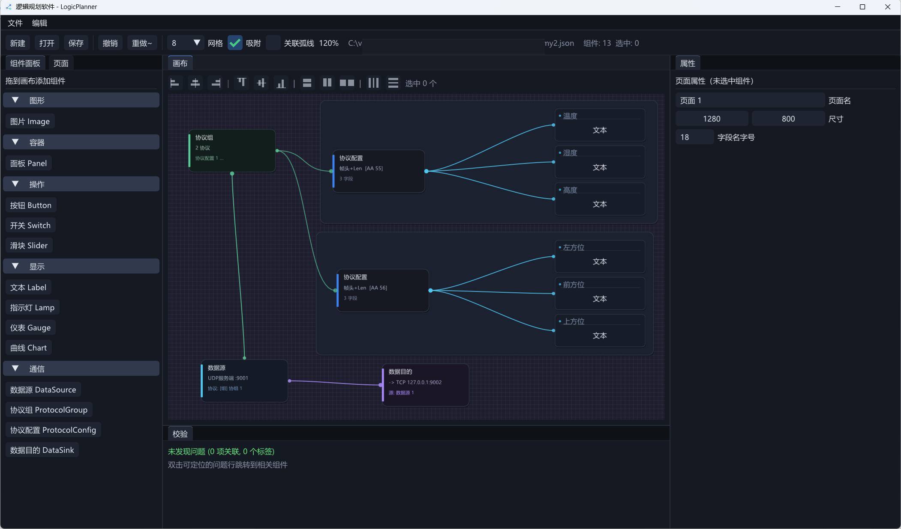
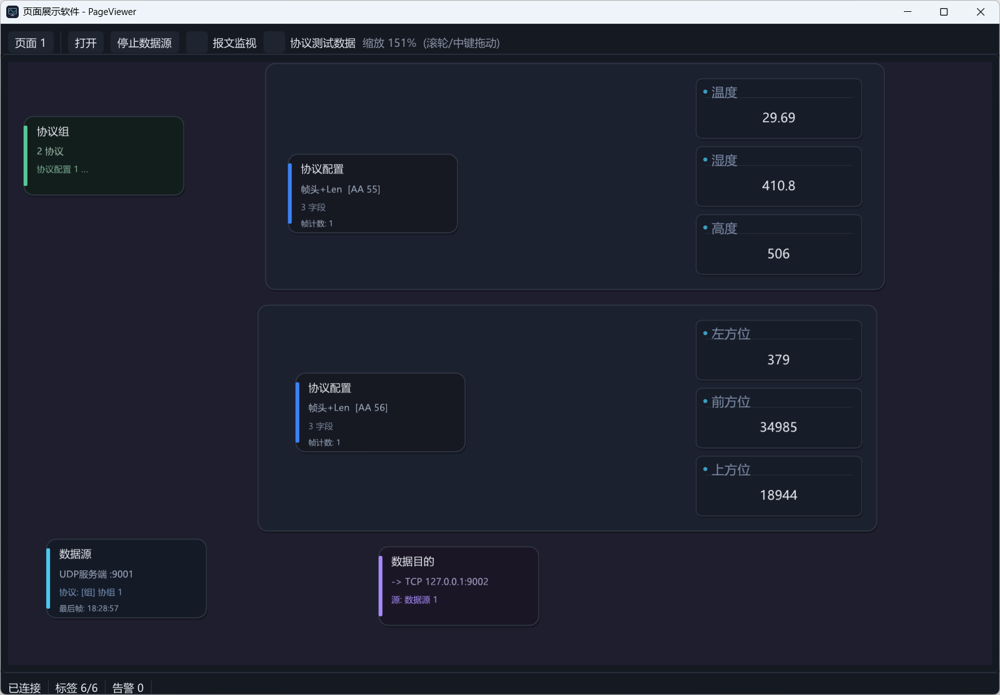
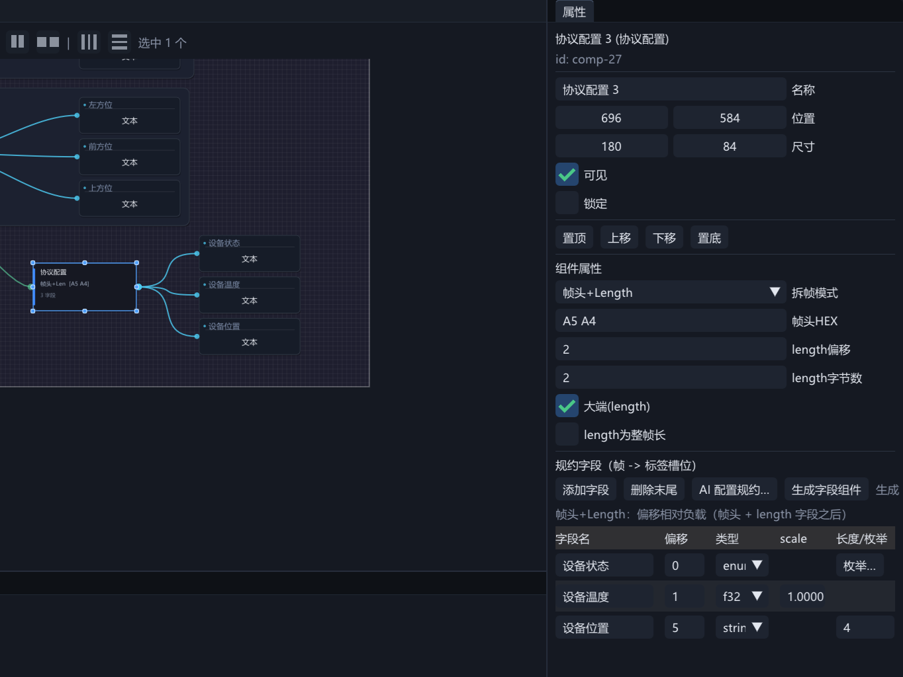
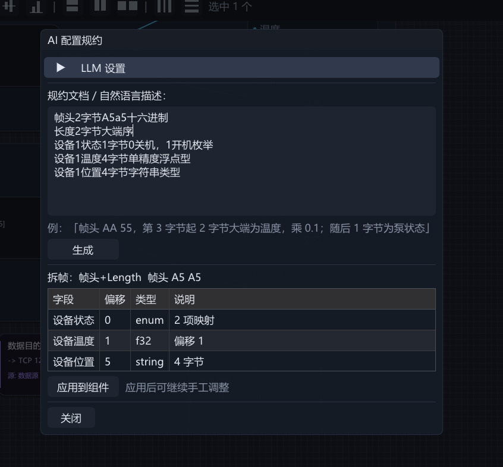

# PlanView — Windows 轻量级 HMI 组态软件

面向工控/自动化现场的组态套件：**设计器 LogicPlanner** 在画布上拖拽组件、配置协议解析与关联，生成 `.json` 工程；**运行器 PageViewer** 加载工程，接设备/链路实时刷新画面、交互写回。C++20 / Dear ImGui / Win32+DX11，单仓双 exe，开箱即用。

## 解决的痛点

| 现场痛点 | PlanView 的解法 |
|---|---|
| 私有二进制协议五花八门，每接一种设备都要定制开发 | **协议配置组件**画布上配拆帧（TLV / 帧头+Length）与字段表即可接入，零代码；一个协议可被多个数据源复用 |
| 有协议文档，手填字段表繁琐易错 | **AI 配置规约**：把文档或自然语言描述粘贴给 LLM（OpenAI 兼容接口），自动生成拆帧参数与字段，预览后一键应用 |
| 组态前先建点表/标签库，配置链路又长又绕 | 显示组件**直接绑定协议字段**，标签与数据绑定自动合成；「生成字段组件」按字段类型一键批量生成并绑定 |
| 一条链路混跑多种规约（不同帧头共线传输） | **协议组**多帧头合并解析：各协议字段只由命中自身帧头的帧驱动，AA55 帧不污染 AA56 协议 |
| 链路不能中断、也插不进代理设备 | **监听**传输旁听固定三元组（目的 IP/端口/协议，任一方向命中）；交换机 SPAN 镜像口用**镜像抓包**收"别人之间"的流量 |
| 采到的数据还要上送 SCADA / 第三方平台 | **数据目的**组件把数据源收到的原始帧原样转发到 TCP/UDP/串口端点，当网关用 |
| 手头没有设备，开发调试无从下手 | **协议测试数据**按工程规约生成随机帧、TCP/UDP 模拟器脚本、报文监视实时 HEX+解析、画布通信统计卡片 |
| 组态软件常见"画的和跑的不一样" | 设计器与运行器调用**同一渲染函数**（链接期保证所见即所得），改样式只改一处 |
| 高分屏发糊、多屏缩放不一致 | 界面按显示器 DPI 自适应（字体/间距/画布），`PV_UI_SCALE` 可强制指定倍率 |

## 功能特征

### 设计器 LogicPlanner



- **画布组态**：组件面板拖入创建（双击添加到左上角），滚轮缩放、中键平移、框选/Ctrl 多选、8 手柄缩放、网格吸附
- **对齐工具栏**：多选后左右/水平居中、顶底/垂直居中、等宽等高、水平/垂直等距分布，以最后点击的组件（锚点）为基准
- **属性面板**编辑选中组件的类型化属性/几何/层级；Ctrl+Z/Y 撤销重做、Ctrl+C/V/D 复制粘贴再制
- **关联可视化**：数据源→协议（蓝）、协议字段→显示组件（青）、协议组（绿）、数据目的（紫）四色曲线直观看清数据流向
- **标签库与关联面板**：需要精细控制时仍可手工定义标签（槽位+类型+scale/offset）与三类关联；**校验面板**扫描悬空引用与配置问题

### 运行器 PageViewer



- 打开工程（或命令行直接指定，或欢迎界面"打开上次"）即可投运；帧数据源「自动启动」默认关，顶栏手动启动/停止，勾选后打开即连
- 左键操作 Button/Switch/Slider（有绑定时自动写回），右键任意组件查看详情（绑定值/质量/告警）
- 断线自动重连（1s 退避），标签进入 CommLost 灰态；**报文监视**实时展示原始帧 HEX 与解析结果

### 协议接入与通信



「通信」分类下四个画布组件职责分离、按名称关联：

- **协议配置 ProtocolConfig** —— 定义"怎么拆帧、字段在哪"：
  - 拆帧方式：**TLV**（槽位上限随 tagBytes 自适应）或 **帧头+Length**（字段偏移相对负载、按长度字段做边界校验）
  - 字段类型：`u8..f64` 整浮点、`bool`、定长 `string`、`enum` 枚举（取名称文本、未命中回退数值，映射行内弹窗编辑）；数值字段支持 **scale 工程换算**（工程值 = 原始值 × scale）
  - 编辑体验：表格式行内编辑；新增字段 TLV 槽位默认继承前一条、偏移默认接续上一字段末尾
  - 「**生成字段组件**」按字段类型一键生成显示组件并自动绑定（bool→指示灯，其余→文本，纵向排列在协议组件下方）
- **数据源 DataSource** —— 定义"从哪收"：
  - TCP/UDP × 客户端/服务端四种角色 + **串口**（波特率 300..921600、数据位 5..8、校验无/奇/偶、停止位 1/2，字节流与 TCP 同一拆帧）
  - **监听**传输（旁听既有链路，不参与通信）：固定三元组 dip/dport/协议，命中=任一方向。两种方式——「**本机端口**」（默认，普通 socket：UDP 绑定 dport、命中=源为 dip:dport（反向）或 dip=`*` 全收（正向）；TCP 监听 dport、仅接受对端 IP=dip 的接入、连接内双向解析，未命中一律丢弃不驱动字段）；「**镜像抓包**」（Npcap 混杂模式，收交换机 SPAN 口上"别人之间"的完整会话，放行 802.1Q VLAN 帧；TCP 按四元组+方向逐流拆帧、尽力而为；需运行机器安装 [Npcap](https://npcap.com)，未装仅该方式不可用并给安装提示，**构建/测试不依赖 Npcap SDK**）
  - 「关联协议/组」下拉二选一；断线 1s 退避自动重连
- **协议组 ProtocolGroup** —— 数据源按组关联**多个协议合并解析**：TLV 多协议按 T 值分段；帧头+Length 不同帧头的成员**多帧头识别**（字节流按各帧头分别拆帧）；画布绿色曲线连接数据源→协议组→各成员
- **数据目的 DataSink** —— 按名称关联数据源，运行器把收到的**原始帧原样转发**到 TCP/UDP/串口端点（网关/上传场景）；尽力而为转发（断线丢帧、2s 退避重连），随数据源启停同步

**显示组件直接绑定协议字段**：文本/仪表/指示灯/曲线的属性面板「绑定协议字段」下拉选中即完成（画布青色曲线）；运行器打开工程时自动合成隐式标签与数据绑定（Label→text、Lamp/Switch→isOn、其余→value），无需手工建标签库。绑定的组件以**复合卡片**显示（同卡显字段名+值/波形/灯体/表盘，字段名字号在页面属性中统一调节、随工程保存）。

**调试与观测**：画布通信卡片显示运行统计（数据源"最后帧"时间、协议配置"帧计数"按协议各自统计）；「**协议测试数据**」独立窗口按工程规约生成随机帧 HEX（可复制/保存 TXT 喂回链路验证解析与转发）；运行器顶栏报文监视看原始帧与解析结果。帧数据源 v1 只收不发。

### AI 配置规约（自然语言生成协议字段）



协议配置组件属性面板「AI 配置规约…」：粘贴规约文档或自然语言描述，LLM 自动生成拆帧参数与字段，表格预览后一键应用，仍可手工微调。适合"有报文说明、懒得手填字段"的场景。

- **接口**：OpenAI 兼容接口，填 Base URL / API Key / 模型名（默认智谱 `glm-4-flash`）；配置保存在 exe 目录 `llm_config.json`，下次自动加载
- **输入示例**：「帧头 AA 55，第 3 字节起 2 字节大端为温度，乘 0.1；随后 1 字节为泵状态」——TLV 与帧头+Length 都支持
- **生成**：后台线程异步请求（约 60s 超时），容忍 ```json 围栏与前后杂文字，表格预览拆帧方式/字段名/槽位或偏移/类型/说明
- **覆盖能力**：数值(u8..f64)/布尔/定长字符串/枚举映射，可一并给出 scale 工程换算与字节序
- **应用**：写入拆帧属性+字段（槽位按字段序号自动分配），即生成隐式标签与绑定

### 数据联动、告警与写回

| 关联类型 | 语义 |
|---|---|
| 数据绑定 dataBinding | 组件属性 ← 标签实时值 |
| 组件联动 linkage | 源组件事件 → 目标动作（设置属性、页面跳转、显隐切换、写标签、脉冲高亮） |
| 阈值告警 alarmRule | 标签越限 → 视觉告警（闪烁/描边/变色，可锁存需确认） |

联动传播深度上限 8 层（环防护）；告警默认覆盖绑定该标签的全部组件，也可显式指定。

## 快速开始

### 构建

需要 Visual Studio 2022+（含 C++ 桌面开发与 CMake 组件）：

```bat
:: 命令行（推荐）；或 VS 打开仓库根目录选 CMake 预设
scripts\build.cmd x64-debug      :: 另有 x64-release / x86-*
```

依赖（Dear ImGui `v1.92.9b-docking`、nlohmann/json）经 CMake FetchContent 自动拉取，默认 gitee 镜像、可用 `-D PV_IMGUI_REPO=...` 覆盖，首次配置需联网。Npcap 为**可选运行时依赖**（仅镜像抓包需要，见上）。产物直接位于 `out/build/<preset>/`：`LogicPlanner.exe`、`PageViewer.exe`、`pv_tests.exe`。

### 端到端演示

```bat
:: 1) 启动数据服务器模拟器（槽位 0-5 正弦波 / 6 随机游走 / 7 方波 / 8 计数器）
python tools\tcp_sim.py 9000

:: 2) 运行器打开演示工程
out\build\x64-debug\PageViewer.exe examples\demo_project.json
```

可看到：仪表/曲线随数据刷新，按钮写回槽位 7，温度/液位越限触发闪烁与描边告警（锁存告警可在顶部告警条确认），页面跳转，滑块写回槽位 6。帧数据源另有 UDP TLV 模拟器 `python tools\udp_frame_sim.py 9001` 与示例工程 `examples\demo_frame_project.json`（数据源+泵站协议+组件直绑字段）。

## 单元测试

```bat
scripts\build.cmd x64-debug pv_tests
out\build\x64-debug\pv_tests.exe
```

覆盖：模型 JSON 字节级往返与高版本拒载、协议黄金行、TCP 回环（含应答分片重组）、引擎语义（绑定刷新、联动级联与环截断、告警锁存确认、写回排队、数据质量）。

### 性能测试（随 pv_tests 运行，仅 Release 生效）

`test_Perf` 两个用例测量并打印吞吐参考值（x64-release 本机实测，随机器而异；Debug 构建自动 `[skip]`——未优化的数值没有参考意义）：

- **协议解析管线**：2 万帧泵站样板帧（帧头+Length，36B/帧，10 字段覆盖整数/浮点/scale 换算/布尔/枚举/字符串）拼成字节流、按 1448B 分段（模拟 MSS）依次走 `FrameSplitter` 拆帧 → `decodeFrameOnce` 结构解 → `parsePacket` 字段解析，并核对拆帧零丢失、字段全部解出——参考 **约 24 万帧/秒（8.5 MB/s）**
- **数据源→数据目的转发**：UDP 回环端到端——模拟设备发 2 万帧 → `FrameDataSource` 收帧并按规约解析 → 专用转发队列（与 200 条上限的报文监视日志**解耦**，高帧率不丢转发帧）经数据目的（UDP 客户端）**原样转发** → 平台侧接收端到账；全程零丢失对账（帧数/字节数/首帧字节一致、解析命中数齐全、标签值可读）——参考 **约 3.5 万帧/秒（1.2 MB/s，瓶颈在回环 syscall 链而非解析）**
- 断言下限取参考值的约 1/8~1/7：慢速 CI 也能通过，出现数量级性能退化（如意外引入逐帧拷贝、频繁分配）才判失败；转发测试按 100 帧小批量收发 + 批间短自旋间隙（`sleep` 受 Windows 15.6ms 定时器分辨率限制，会把吞吐压在定时器上），测的是管线吞吐而非突发能力

## 架构与目录（面向开发者）

单一 CMake 工程三个目标：`pv_base`（静态库，两 exe 共用 model / serialize / data / render / runtime / appshell / log）、`LogicPlanner`（设计器）、`PageViewer`（运行器）。

核心不变量：**组件绘制代码只存在于 `ComponentRenderer`**，设计器画布与运行器渲染调用同一函数——"所见即所得"由链接期保证。运行期数据流：工程 `.json` → `RuntimeEngine` 解析关联 → 后台线程收帧/轮询 → 绑定刷新、联动级联、越限告警 → 交互写回排队下发。

```
src/base/       共享库（model / serialize / data / render / runtime / appshell / log）
src/planner/    设计器（Document 承担 undo / panels 各 UI 面板）
src/viewer/     运行器（ViewerApp / PollWorker 后台线程）
tests/          PvTest 自研极简单测框架 + 各模块测试
tools/          tcp_sim.py 行协议模拟器 / udp_frame_sim.py 帧数据源模拟器
examples/       demo_project.json / demo_frame_project.json 演示工程
```

版本变更记录见 [CHANGELOG.md](CHANGELOG.md)。
